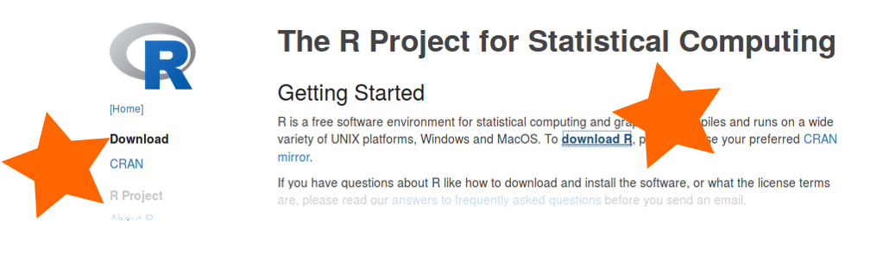
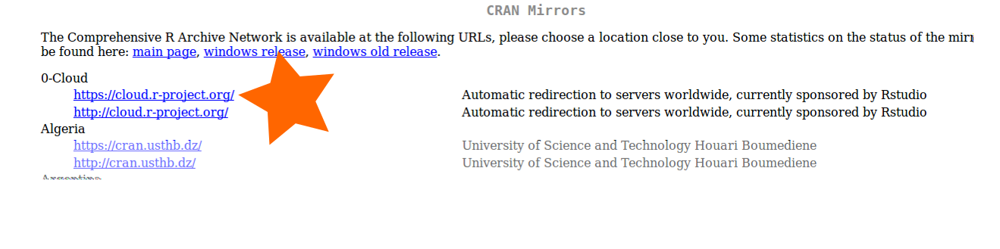
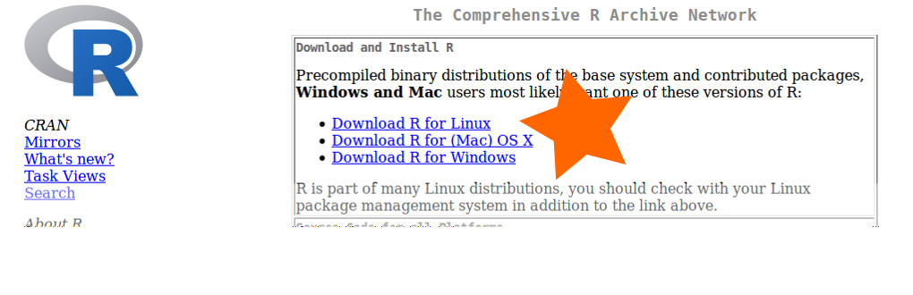

# In class demonstration

## Install R
   1. Go to  <a href='https://www.r-project.org/' target="_blank">https://www.r-project.org/</a>
   2. Click `Download R`
   
   3. Select a mirror (Top mirror will work)
   
   4. Select the link for your operating system
   

## Install RStudio
   1. Go to <a href='https://www.rstudio.com/' target="_blank">https://www.rstudio.com/</a>
   2. Click "Download RStudio"
   3. Select the link for your operating system
