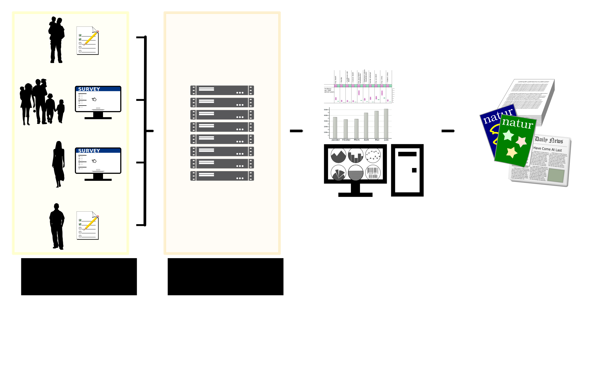
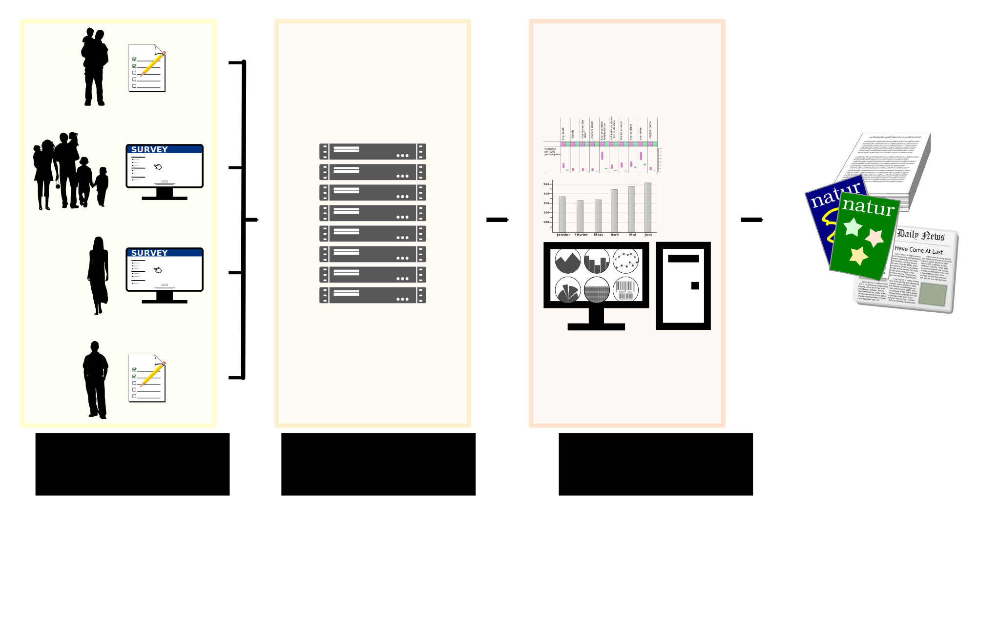
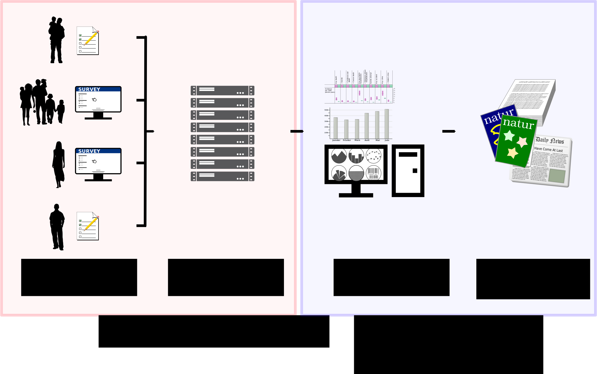

<iframe src="address.html" class="iframe" scrolling="no"  frameborder="0"></iframe>

<iframe class="iframe" scrolling="no" frameborder="0">

</iframe>

<iframe class="iframe" scrolling="no" frameborder="0">

</iframe>

<iframe class="iframe" scrolling="no" frameborder="0">

</iframe>

<iframe class="iframe" scrolling="no" frameborder="0">

</iframe>

<iframe class="iframe" scrolling="no" frameborder="0">

</iframe>

<iframe class="iframe" scrolling="no" frameborder="0">

</iframe>

<iframe src="page2.html" class="iframe" scrolling="no" frameborder="0" ></iframe>

<a class="w3-btn-floating" style="position:absolute;top:45%;left:0" onclick="plusDivs(-1)">❮</a>
<a class="w3-btn-floating" style="position:absolute;top:45%;right:0" onclick="plusDivs(1)">❯</a>
