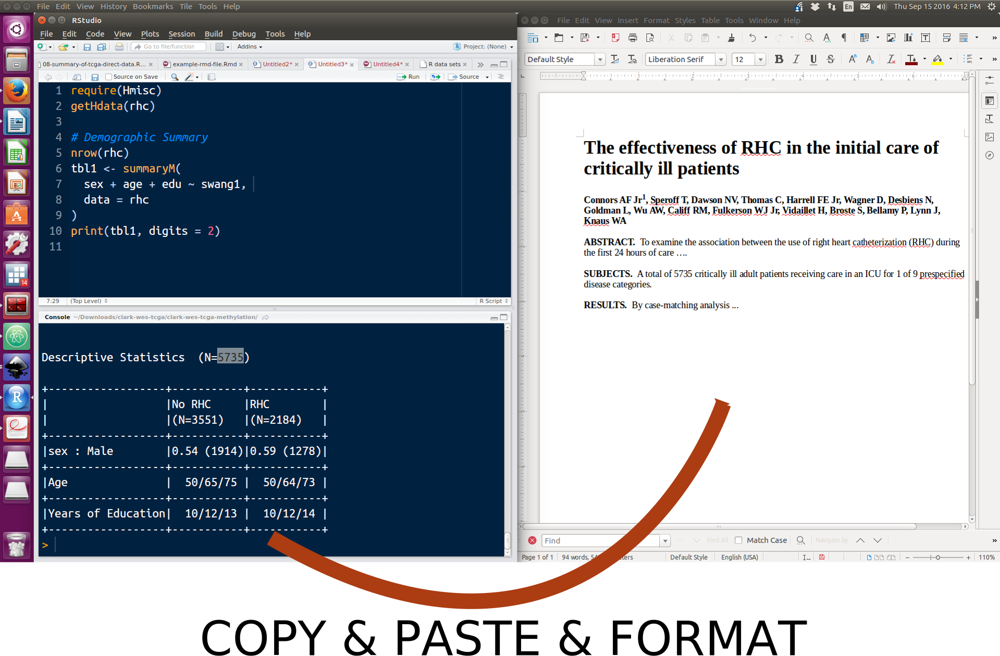

# Not literate programming (The old way of doing things)

* Copy and paste breaks the link between the script and the output in the report.  How do you ensure that the output is properly pasted?
* What do you do if the underlying dataset gets updated with 5 new subjects?
